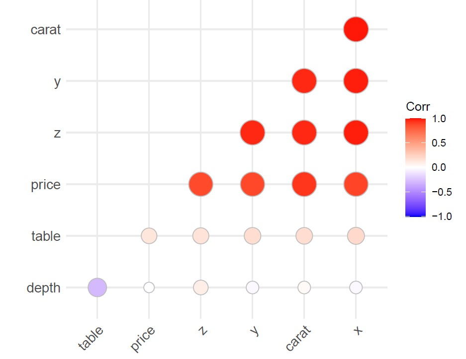

```{r setup, include=FALSE}
knitr::opts_chunk$set(echo = FALSE)
```


```{r, echo=FALSE, message=FALSE, warning = FALSE}
# load required packages
library(ggplot2)
library(GGally)
library(moments)


```

```{r, echo=FALSE}
diamonds <- read.csv("./diamonds.csv", encoding = "UTF-8")
diamonds$X <- NULL
# Set categorical variables as factors and set levels
diamonds$cut <- factor(diamonds$cut, 
                       levels = c("Fair","Good","Very Good","Premium","Ideal"))
diamonds$color <- factor(diamonds$color, 
                         levels = c("J","I","H","G","F","E","D"))
diamonds$clarity <- factor(diamonds$clarity,
                           levels = c("I1","SI2","SI1","VS2","VS1","VVS2","VVS1","IF"))
# Make data frame of just the numerical variables
diamonds_num <- subset(diamonds, select = c(carat,depth,table,price,x,y,z))
```

# Group 11: Diamonds Dataset


# Group Members (photos)


# Group Members (name, email, ORCID)

Tom Tribe

- tom.tribe2016@gmail.com
- 0000-0002-5002-8066

Ken MacIver

- ken.maciver68@gmail.com
- 0000-0001-8999-4598

Jundi Yang

- ivyli112358@gmail.com
- 0000-0003-0888-9564

Mei Huang

- huangmei139@gmail.com
- 0000-0003-2401-0679


# The Diamonds dataset

- This large dataset has 53940 rows (diamonds) of ten variables (approx 540,000 values)\linebreak 
- Slow to process!\linebreak
- There are seven numeric variables and three categorical variables\linebreak
- We selected diamonds because it was conceptually simple to understand what each variable was measuring, and to have the opportunity to use the analytical techniques taught in STAT394 with a large dataset\linebreak


# The Variables
 \textcolor{red}{red font = categorical variable}
 
-   carat: the diamond's weight
-   \textcolor{red}{cut: a measure of quality (4 levels)}
-   \textcolor{red}{color: a measure of colour quality (7 levels)}
-   \textcolor{red}{clarity: a measure of clearness (6 levels)}
-   x: length in mm
-   y: width in mm 
-   z: depth in mm
-   depth: total depth percentage
-   table: width of top of diamond relative to widest point
-   price: the price of the diamond in US dollars 

(List adapted from list at kaggle.com).

# Pairs Plot


# Correlation Plot

{height=80%}


# Normal QQ Plots

{height=80%}


# Price by Categorical 

{height=80%}

# Leading Question 1

- How can we best predict diamond price using the other variables?\linebreak 
- We intend to use the following techniques to investigate this question:\linebreak
- Stepwise Regression, Principal Components Analysis, Principal Components Regression\linebreak

# Multiple Regression

- Starting with the full model we used a stepwise regression procedure to find the best model for predicting diamond price.\linebreak
- According to AIC the best model was:\linebreak
- price ~ carat + cut + color + clarity + depth + table + x\linebreak 
- All variables excluding y and z are significant in the model\linebreak
- The 'best' model had an Adjusted $R^2$ of 91.98%\linebreak 

# Regression Assumptions


# Principal Components Analysis: Screeplot

```{r, echo = FALSE}
set.seed(300525287, kind = "Mersenne-Twister")
smallersample <- diamonds_num[sample(nrow(diamonds_num), "1000"), ]
PCA <- prcomp(smallersample, center = TRUE, scale = TRUE)
```


# Principal Components Analysis: Eigenvectors


{height=85%}

# Biplot

{height=85%}

# Principal Components Regression

- We conducted a Principal Components Regression with diamond price as the response variable\linebreak
- The PCA excluding price was almost identical to the original PCA\linebreak
- We were able to explain over 80% of the variation in price using just the first two principal components as predictors\linebreak 
- A more parsimonious model!\linebreak

# Summary of Models Predicting Diamond Price 

\begin{table}[ht]
\centering
\begin{tabular}{rcc}
  \hline
 Model \vline & No. of Predictors & Adjusted $R^2$ \\ 
  \hline
Full Model \vline & 9 & 0.9198\\
   \hline
Best Model \vline & 7 & 0.9198\\
\hline
Numeric Model \vline & 7 & 0.8592\\
Two PC \vline & 2 & 0.8092\\
All PC \vline & 6 & 0.8695\\
\end{tabular}
\end{table}

# Leading Question 2 ... and the issues we encountered...

- The diamonds dataset includes 280 interactions between different levels of the categorical variables\linebreak
- Our second leading question was to investigate if we could classify the diamonds data more simply using analytical techniques such as LDA and CA\linebreak 


# Problems encountered

- Multiple regression: didn't work well without the categorical variables  
 
- Despite a correlation of 0.9216, 'carat' (a measure of weight) was not a great predictor of 'price'

- LDA not able to separate different levels of the categorical variables

# Colour-coded scatterplot


# Slicing the dataset vertically


# Zoomed in version of vertical slice


# Colour bands more evident in sliced version


# Linear Discriminatory Analysis


# Conclusion 

- Achieved the primary aim to find the best predictor for ‘price’  

- Best model -> price ~ carat + cut + color + clarity + depth + table + x  

- Regression using the PCs produced a reasonable result, even without the categorical variables  

- LDA and CA did not work well due to the amount of overlap between the different levels of the categorical variables - the diamonds dataset presented a tricky classification problem

- Lots of learning figuring out why things did not work!

- Thanks for listening!! :):)
